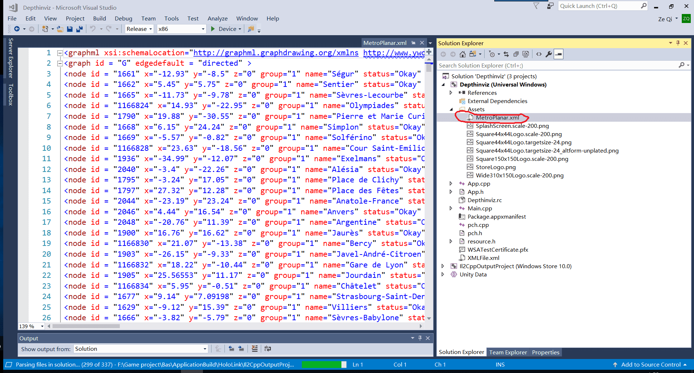

While I was doing my master thesis, I tried to get location information for Paris stations from an XML file and Generate node objects accordingly. In unity, I used the system.xml library to fulfill the function. But it seems is not working in HoloLens. The file cannot be sent into HoloLens after being compiled and deployed.

<left>
    
     
    

     Figure1 The XML I tried to Parse
  	

</left>

Below is the code that I used in unity Editor to parse the XML data. (system.xml)

<left>
    
     
    

Figure2 Parsing XML data from Unity Editor
  	

</left>

<left>
    
     
    

     Figure3 The Station Map I want to get
  	

</left>

So I did some research and find out that the UWP platform is using a different API system called [Windows.data.Xml.Dom](https://docs.microsoft.com/en-us/uwp/api/windows.data.xml.dom?view=winrt-19041)

So while it's running in the UWP platform, you have to use this library to deal with the XML file.

<left>
    
     
    

    Figure4 Parsing XML data for UWP build
  	

</left>

But there is still the problem that the XML is not in the project when I opened it in Visual studio. Then I manually put the XML file into the compiled project folder called Asset. The key is to set the property of the XML file to be included in the build( the default option is excluded)

<left>
    
     
    

     Figure5 Add file process
  	

</left>

<left>
    
     
    

    Figure6 Final Demo
  	

</left>

Also, You can Instantiate the object in edit mode using `[ExecuteInEditMode]`. I found this more customizable. I used this method later during the project. But I have to admit that this is less flexible if you want to change some structure from the bottom. If still get confused about the process, check out these links below where I got inspiration from.

 
 
 
 
 

# Reference

[Discussions about how to load XML files on Hololens in runtime](https://forums.hololens.com/discussion/6472/load-xml-files-on-hololens-in-runtime)

[https://stackoverflow.com/questions/51389737/reading-xml-files-in-a-unity-hololens-project-works-in-editor-not-in-deployed](https://stackoverflow.com/questions/51389737/reading-xml-files-in-a-unity-hololens-project-works-in-editor-not-in-deployed)
